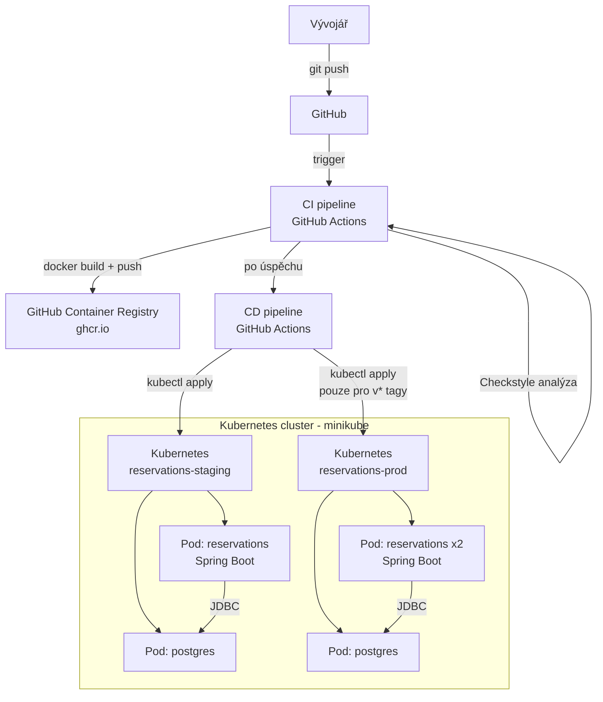

# DevOps – Rezervační systém

**Repozitář:** https://github.com/KryxusCZ/BTDD_Semestralni_Prace

## Obsah
1. [Architektura](#architektura)
2. [CI/CD pipeline](#cicd-pipeline)
3. [Prostředí](#prostředí)
4. [Kontejnerizace](#kontejnerizace)
5. [Kubernetes](#kubernetes)
6. [Správa secrets](#správa-secrets)
7. [Lokální spuštění](#lokální-spuštění)
8. [Nasazení do Kubernetes](#nasazení-do-kubernetes)
9. [Spuštění po restartu PC / Prezentace](#spuštění-po-restartu-pc--prezentace)
10. [Ověření funkčnosti](#ověření-funkčnosti)

---

## Architektura

Systém se skládá z jedné REST API služby (Spring Boot) a relační databáze (PostgreSQL). V Kubernetes jsou obě komponenty nasazeny jako samostatné Deploymenty ve vlastních namespacech.



### Hlavní komponenty

| Komponenta | Technologie | Popis |
|---|---|---|
| REST API | Spring Boot 4, Java 17 | Rezervační logika, HTTP endpointy |
| Databáze | PostgreSQL 16 | Perzistence dat |
| Kontejnery | Docker | Balení aplikace |
| Orchestrace | Kubernetes (minikube) | Nasazení, škálování, health checks |
| CI/CD | GitHub Actions | Automatizovaný build, test, nasazení |
| Registry | GitHub Container Registry | Úložiště Docker image |

---

## CI/CD pipeline

### CI (`.github/workflows/ci.yml`)

Spouští se automaticky při každém `push` a `pull_request`.

```
push / PR
    │
    ├─► build-and-test
    │       ├── checkout
    │       ├── setup Java 17
    │       ├── ./mvnw verify
    │       │       ├── unit testy (Mockito)
    │       │       ├── integrační testy (MockMvc + H2)
    │       │       ├── Checkstyle (statická analýza)
    │       │       └── JaCoCo (code coverage)
    │       └── upload artefaktů
    │               ├── jacoco-report
    │               ├── checkstyle-report
    │               └── test-results
    │
    └─► docker (pouze main nebo v* tag)
            ├── login do GHCR
            ├── docker build (multi-stage)
            └── docker push → ghcr.io/kryxuscz/btdd_semestralni_prace
```

### CD (`.github/workflows/cd.yml`)

Spouští se automaticky po úspěšném dokončení CI (`workflow_run`), nebo ručně přes `workflow_dispatch`.

```
CI dokončeno úspěšně
    │
    ├─► Deploy to Staging (vždy)
    │       ├── kubectl apply k8s/namespace.yaml
    │       ├── kubectl apply k8s/staging/
    │       ├── kubectl set image (nový tag)
    │       ├── kubectl rollout status --timeout=300s
    │       └── smoke test (wget uvnitř podu)
    │
    └─► Deploy to Production (pouze v* tagy)
            ├── kubectl apply k8s/prod/
            ├── kubectl set image (nový tag)
            ├── kubectl rollout status --timeout=600s
            └── rollback při selhání (kubectl rollout undo)
```

---

## Prostředí

| Vlastnost | Staging | Production |
|---|---|---|
| Namespace | `reservations-staging` | `reservations-prod` |
| Repliky aplikace | 1 | 2 |
| Repliky databáze | 1 | 1 |
| Storage | `emptyDir` (ephemeral) | `PersistentVolumeClaim` (1Gi) |
| SQL logy | zapnuty (`show-sql=true`) | vypnuty (`show-sql=false`) |
| CPU request/limit | 100m / 500m | 200m / 1000m |
| Paměť request/limit | 256Mi / 512Mi | 512Mi / 1Gi |
| Trigger nasazení | každý push na main | pouze `v*` tagy |
| Ingress host | `reservations-staging.local` | `reservations.local` |

### Konfigurace prostředí

Konfigurace je oddělena od Docker image pomocí Kubernetes ConfigMap a Secret:

- **ConfigMap** – nekritické hodnoty (URL databáze, Spring profil, nastavení JPA)
- **Secret** – citlivé hodnoty (heslo databáze, uživatelské jméno) zakódované base64

Aplikace čte konfiguraci z environment variables, které jsou injektovány z ConfigMap a Secret:

```yaml
envFrom:
  - configMapRef:
      name: reservations-config
  - secretRef:
      name: reservations-secret
```

---

## Kontejnerizace

### Dockerfile

Používá **multi-stage build** pro minimální výsledný image:

1. **Builder stage** – Maven sestavení JAR souboru (JDK 17)
2. **Runtime stage** – pouze JRE 17, bez build nástrojů

Bezpečnostní opatření:
- Aplikace běží pod **ne-root uživatelem** (`appuser`)
- **HEALTHCHECK** ověřuje dostupnost `/actuator/health`

### Lokální vývoj – docker-compose

```bash
docker-compose up --build
```

Spustí:
- PostgreSQL na portu `5432`
- Spring Boot aplikaci na portu `8080` s profilem `prod`

Aplikace dostupná na `http://localhost:8080/actuator/health`

---

## Kubernetes

### Struktura manifestů

```
k8s/
├── namespace.yaml          # definice namespaců staging + prod
├── staging/
│   ├── configmap.yaml      # konfigurace staging prostředí
│   ├── secret.yaml         # přihlašovací údaje (base64)
│   ├── deployment.yaml     # Deployment aplikace + PostgreSQL
│   ├── service.yaml        # ClusterIP Service pro app + DB
│   └── ingress.yaml        # Ingress pravidla
└── prod/
    ├── configmap.yaml
    ├── secret.yaml
    ├── deployment.yaml     # 2 repliky, PVC pro PostgreSQL
    ├── service.yaml
    └── ingress.yaml
```

### Resource limity

Každý Pod má nastaveny `requests` (garantované zdroje) a `limits` (maximální zdroje), aby nedocházelo k přetížení clusteru.

### Health checks

Kubernetes ověřuje stav aplikace pomocí dvou sond:
- **livenessProbe** – pokud selže, Pod se restartuje
- **readinessProbe** – pokud selže, Pod nedostává traffic

Obě sondy volají Spring Boot Actuator endpoint `/actuator/health`.

---

## Správa secrets

**V repozitáři nejsou uložena žádná plaintext hesla.**

| Vrstva | Řešení |
|---|---|
| Kubernetes | `Secret` objekt s base64 hodnotami, injektován jako env var |
| GitHub Actions CI | `GITHUB_TOKEN` automaticky poskytnut GitHubem (pro push do GHCR) |
| GitHub Actions CD | Self-hosted runner s přímým přístupem ke kubectl (bez nutnosti ukládat kubeconfig) |

Pro produkční prostředí je doporučeno použít Kubernetes Sealed Secrets nebo HashiCorp Vault místo base64 v repozitáři.

---

## Lokální spuštění

### Požadavky a instalace

| Nástroj | Verze | Instalace |
|---|---|---|
| Java (JDK) | 17+ | https://adoptium.net |
| Docker Desktop | latest | https://www.docker.com/products/docker-desktop |
| minikube | latest | `winget install minikube` nebo https://minikube.sigs.k8s.io |
| kubectl | latest | `winget install kubectl` nebo součást Docker Desktop |
| Git | latest | https://git-scm.com |

#### Ověření instalace

```bash
java -version
docker --version
minikube version
kubectl version --client
```

#### Klonování repozitáře

```bash
git clone https://github.com/KryxusCZ/BTDD_Semestralni_Prace.git
cd BTDD_Semestralni_Prace
```

### Spuštění aplikace lokálně (H2 databáze)

```bash
./mvnw spring-boot:run
```

Aplikace běží na `http://localhost:8080`

### Spuštění testů

```bash
./mvnw verify
```

Vygenerované reporty:
- Coverage: `target/site/jacoco/index.html`
- Testy: `target/surefire-reports/`

### Spuštění s Docker Compose (PostgreSQL)

```bash
docker-compose up --build
```

---

## Nasazení do Kubernetes

### 1. Spuštění minikube

```bash
minikube start --driver=docker
minikube addons enable ingress
```

### 2. Aplikování manifestů

```bash
kubectl apply -f k8s/namespace.yaml
kubectl apply -f k8s/staging/
```

### 3. Ověření stavu

```bash
kubectl get all -n reservations-staging
```

### 4. Přístup k aplikaci

```bash
kubectl port-forward svc/reservations 8080:80 -n reservations-staging
```

Aplikace dostupná na `http://localhost:8080/actuator/health`

### Rollback

```bash
kubectl rollout undo deployment/reservations -n reservations-staging
```

---

## Spuštění po restartu PC

Tento postup je nutné provést pokaždé, když byl počítač vypnut nebo restartován.

### Krok 1 – Spustit Docker Desktop

Otevři Docker Desktop a počkej, dokud nezobrazí stav **Running** (zelená ikona v systémové liště).

### Krok 2 – Spustit minikube

```bash
minikube start --driver=docker
```

Počkej na výpis:
```
Done! kubectl is now configured to use "minikube" cluster
```

### Krok 3 – Ověřit stav podů

```bash
kubectl get pods -n reservations-staging
kubectl get pods -n reservations-prod
```

Pody se obvykle samy obnoví po startu minikube. Pokud mají stav `Running` — hotovo, přejdi na Krok 5.

Pokud pody nejsou spuštěné nebo hlásí chybu, znovu aplikuj manifesty:

```bash
kubectl apply -f k8s/namespace.yaml
kubectl apply -f k8s/staging/
kubectl apply -f k8s/prod/
```

### Krok 4 – Počkat na nastartování aplikace

Aplikace startuje přibližně 60–90 sekund. Sleduj stav:

```bash
kubectl get pods -n reservations-staging -w
```

Čekej dokud oba pody nezobrazí `1/1 Running`. Ukonči sledování pomocí `Ctrl+C`.

### Krok 5 – Spustit self-hosted runner (pro CD pipeline)

Otevři nový terminál a spusť runner:

```bash
cd C:\WINDOWS\system32\actions-runner
./run.cmd
```

Runner musí hlásit `Listening for Jobs` — pak je CD pipeline funkční.

### Krok 6 – Port-forward pro přístup k API

```bash
kubectl port-forward svc/reservations 8080:80 -n reservations-staging
```

Aplikace je dostupná na `http://localhost:8080`

### Krok 7 – Ověřit testovací data

Aplikace automaticky vkládá testovací data při startu pomocí `data.sql` (users, rooms). Data jsou vložena pouze pokud ještě neexistují (`ON CONFLICT DO NOTHING`).

Ověření dat v databázi:

```bash
kubectl exec -it deployment/postgres -n reservations-staging -- psql -U reservations -d reservations
```

```sql
SELECT * FROM users;
SELECT * FROM rooms;
\q
```

### Shrnutí – rychlý přehled příkazů

```bash
# 1. Docker Desktop spustit ručně přes GUI

# 2. Minikube
minikube start --driver=docker

# 3. Ověřit pody
kubectl get pods -n reservations-staging
kubectl get pods -n reservations-prod

# 4. Případně znovu nasadit
kubectl apply -f k8s/namespace.yaml
kubectl apply -f k8s/staging/
kubectl apply -f k8s/prod/

# 5. Runner (nový terminál)
cd C:\WINDOWS\system32\actions-runner && ./run.cmd

# 6. Port-forward (další terminál)
kubectl port-forward svc/reservations 8080:80 -n reservations-staging
```

---

## Ověření funkčnosti

### 1. CI pipeline

Po každém `push` na GitHub zkontroluj záložku **Actions** → workflow **CI** musí být zelený.

Artefakty ke stažení v CI runu:
- `jacoco-report` – přehled pokrytí kódu
- `checkstyle-report` – výsledky statické analýzy
- `test-results` – výsledky testů

### 2. Docker image v GHCR

Po zeleném CI běhu na `main` větvi:

```
GitHub repo → Packages → btdd_semestralni_prace
```

Musí být vidět tag `main` (nebo `v1.0.0` po tagu).

### 3. Kubernetes – staging

```bash
# Ověření běžících podů
kubectl get pods -n reservations-staging

# Oba pody musí být 1/1 Running
# NAME                            READY   STATUS    RESTARTS
# postgres-xxx                    1/1     Running   0
# reservations-xxx                1/1     Running   0

# Health check aplikace
kubectl exec deployment/reservations -n reservations-staging -- wget -q -O- http://localhost:8080/actuator/health

# Odpověď musí obsahovat: "status":"UP"
```

### 4. Kubernetes – production

```bash
kubectl get pods -n reservations-prod

# Musí běžet 2 repliky aplikace + 1 postgres
# NAME                            READY   STATUS    RESTARTS
# postgres-xxx                    1/1     Running   0
# reservations-xxx-1              1/1     Running   0
# reservations-xxx-2              1/1     Running   0
```

### 5. REST API – funkční test

```bash
kubectl port-forward svc/reservations 8080:80 -n reservations-staging
```

Otevři prohlížeč nebo použij curl:

```
GET  http://localhost:8080/actuator/health
```

Vytvoření rezervace (nejprve je třeba mít uživatele a místnost v databázi):

```
POST http://localhost:8080/reservations
Content-Type: application/json

{
  "userId": 1,
  "roomId": 1,
  "startTime": "2027-06-01T10:00:00",
  "endTime": "2027-06-01T12:00:00"
}
```

### 6. CD pipeline

Po push na `main` → CI doběhne → CD se automaticky spustí a nasadí do stagingu.

Pro produkci: push tagu `v*`:

```bash
git tag v1.0.0
git push origin v1.0.0
```

CI → staging → production proběhnou automaticky v sekvenci.

---

### Příprava
- [ ] Docker Desktop spuštěn
- [ ] `minikube start --driver=docker`
- [ ] `kubectl get pods -n reservations-staging` → oba pody `1/1 Running`
- [ ] `kubectl get pods -n reservations-prod` → 3 pody `1/1 Running`
- [ ] Runner spuštěn: `cd C:\WINDOWS\system32\actions-runner && ./run.cmd` → `Listening for Jobs`
- [ ] Port-forward: `kubectl port-forward svc/reservations 8080:80 -n reservations-staging`
- [ ] Otevřít `requests.http` v IntelliJ
