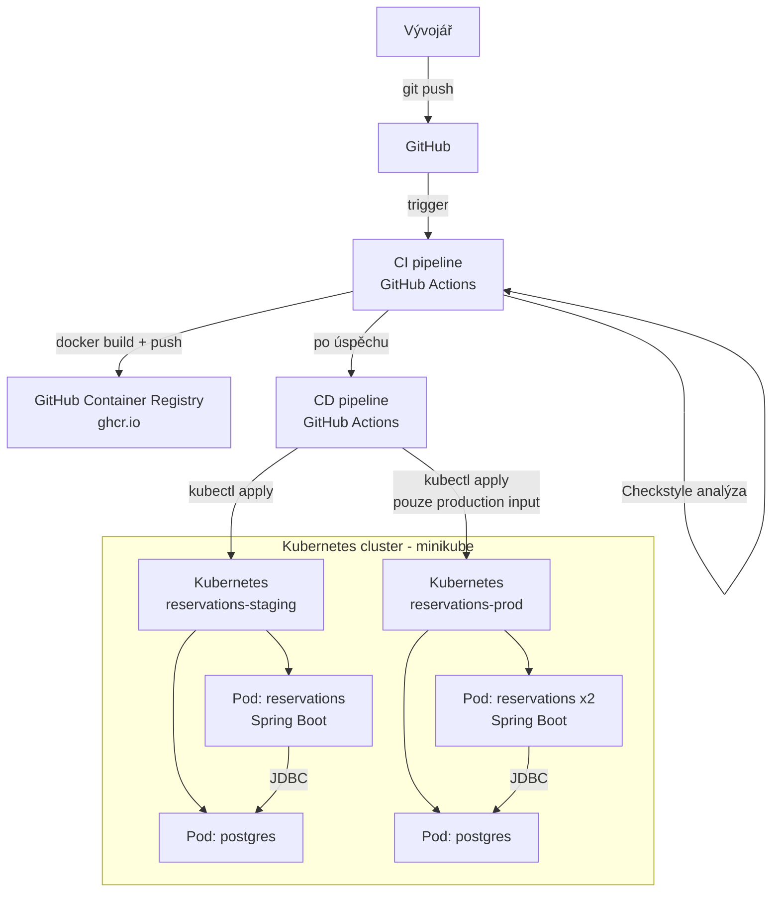

# DevOps – Rezervační systém

**Repozitář:** https://github.com/KryxusCZ/BTDD_Semestralni_Prace

## Obsah
1. [Architektura](#architektura)
2. [CI/CD pipeline](#cicd-pipeline)
3. [Prostředí](#prostředí)
4. [Kontejnerizace](#kontejnerizace)
5. [Kubernetes](#kubernetes)
6. [Správa secrets](#správa-secrets)
7. [Instalace a požadavky](#instalace-a-požadavky)
8. [Lokální spuštění](#lokální-spuštění)
9. [Nasazení do Kubernetes](#nasazení-do-kubernetes)
10. [Spuštění po restartu PC](#spuštění-po-restartu-pc)
11. [Ověření funkčnosti](#ověření-funkčnosti)

---

## Architektura

REST API (Spring Boot) + PostgreSQL, nasazeno v Kubernetes (minikube) ve dvou namespacech.



| Komponenta | Technologie | Popis |
|---|---|---|
| REST API | Spring Boot 4, Java 17 | Rezervační logika, HTTP endpointy |
| Databáze | PostgreSQL 16 | Perzistence dat (prod/staging), H2 in-memory pro testy |
| Kontejnery | Docker | Balení aplikace |
| Orchestrace | Kubernetes (minikube) | Nasazení, škálování, health checks |
| CI/CD | GitHub Actions | Automatizovaný build, test, nasazení |
| Registry | GitHub Container Registry | Úložiště Docker image |

---

## CI/CD pipeline

### CI (`.github/workflows/ci.yml`)

Spouští se při každém `push` a `pull_request`.

```
push / PR
    │
    ├─► build-and-test
    │       ├── setup Java 17
    │       ├── ./mvnw verify
    │       │       ├── unit testy (Mockito)
    │       │       ├── integrační testy (MockMvc + H2)
    │       │       ├── Checkstyle (statická analýza)
    │       │       └── JaCoCo (code coverage)
    │       └── artefakty: jacoco-report, checkstyle-report, test-results
    │
    └─► docker (pouze main nebo v* tag)
            ├── docker build (multi-stage)
            └── docker push → ghcr.io/kryxuscz/btdd_semestralni_prace
```

### CD (`.github/workflows/cd.yml`)

Spouští se automaticky po úspěšném CI (`workflow_run`), nebo ručně přes `workflow_dispatch`.

```
CI dokončeno úspěšně
    │
    ├─► Deploy to Staging (vždy)
    │       ├── kubectl apply k8s/namespace.yaml
    │       ├── kubectl apply k8s/staging/
    │       ├── kubectl set image (nový tag)
    │       ├── kubectl rollout status --timeout=300s
    │       └── smoke test (wget /actuator/health uvnitř podu)
    │
    └─► Deploy to Production (pouze při workflow_dispatch s environment=production)
            ├── kubectl apply k8s/prod/
            ├── kubectl set image (nový tag)
            ├── kubectl rollout status --timeout=600s
            └── rollback při selhání (kubectl rollout undo)
```

---

## Prostředí

| Vlastnost | Staging | Production |
|---|---|---|
| Namespace | `reservations-staging` | `reservations-prod` |
| Repliky aplikace | 1 | 2 |
| Storage databáze | `emptyDir` (ephemeral) | `PersistentVolumeClaim` (1Gi) |
| SQL logy | zapnuty | vypnuty |
| CPU request/limit | 100m / 500m | 200m / 1000m |
| Paměť request/limit | 256Mi / 512Mi | 512Mi / 1Gi |
| Trigger nasazení | každý push na main | workflow_dispatch s `environment=production` |
| Ingress host | `reservations-staging.local` | `reservations.local` |
| Seed data | automaticky při startu (`data.sql`) | automaticky při startu (`data.sql`) |

Konfigurace je oddělena od Docker image přes Kubernetes **ConfigMap** (nekritické hodnoty) a **Secret** (hesla, zakódované base64):

```yaml
envFrom:
  - configMapRef:
      name: reservations-config
  - secretRef:
      name: reservations-secret
```

---

## Kontejnerizace

### Dockerfile

Multi-stage build:
1. **Builder** – Maven sestaví JAR (JDK 17)
2. **Runtime** – pouze JRE 17 + JAR (menší image, bez build nástrojů)

- Aplikace běží pod **ne-root uživatelem** (`appuser`)
- `HEALTHCHECK` volá `/actuator/health`

### docker-compose

Spuštění aplikace + PostgreSQL lokálně:

```bash
docker-compose up --build
```

Aplikace dostupná na `http://localhost:8080/actuator/health`

---

## Kubernetes

### Struktura manifestů

```
k8s/
├── namespace.yaml              # namespacy staging + prod
├── staging/
│   ├── configmap.yaml          # konfigurace prostředí
│   ├── secret.yaml             # přihlašovací údaje (base64)
│   ├── deployment.yaml         # app (1 replika) + postgres
│   ├── service.yaml            # ClusterIP service
│   └── ingress.yaml            # HTTP routing
└── prod/
    ├── configmap.yaml
    ├── secret.yaml
    ├── deployment.yaml         # app (2 repliky) + postgres s PVC
    ├── service.yaml
    └── ingress.yaml
```

Každý Pod má nastaveny `requests` (garantované zdroje) a `limits` (maximální zdroje).

### Health checks

- **livenessProbe** – pokud selže → Pod se restartuje
- **readinessProbe** – pokud selže → Pod nedostává traffic

Obě sondy volají `/actuator/health/liveness` a `/actuator/health/readiness`.

---

## Správa secrets

V repozitáři nejsou žádná plaintext hesla.

| Vrstva | Řešení |
|---|---|
| Kubernetes | `Secret` objekt (base64), injektován jako env var do Podu |
| GitHub Actions CI | `GITHUB_TOKEN` automaticky od GitHubu (push do GHCR) |
| GitHub Actions CD | Self-hosted runner s přímým přístupem ke kubectl |

---

## Instalace a požadavky

| Nástroj | Instalace |
|---|---|
| Java 17+ | https://adoptium.net |
| Docker Desktop | https://www.docker.com/products/docker-desktop |
| minikube | `winget install minikube` |
| kubectl | součást Docker Desktop |
| Git | https://git-scm.com |

```bash
# Ověření
java -version
docker --version
minikube version
kubectl version --client
```

```bash
# Klonování
git clone https://github.com/KryxusCZ/BTDD_Semestralni_Prace.git
cd BTDD_Semestralni_Prace
```

---

## Lokální spuštění

### Aplikace s H2 (pouze dev, bez databázového serveru)

```bash
./mvnw spring-boot:run
```

H2 je in-memory databáze — běží v paměti aplikace, po restartu je prázdná. Slouží pouze pro lokální vývoj a testy, ne pro produkci.

Dostupné endpointy:
- `http://localhost:8080/actuator/health`
- `http://localhost:8080/h2-console` (JDBC URL: `jdbc:h2:mem:testdb`, user: `sa`, heslo: prázdné)

### Testy

```bash
./mvnw verify
```

- Coverage report: `target/site/jacoco/index.html`
- Test results: `target/surefire-reports/`

### Docker Compose (aplikace + PostgreSQL)

```bash
docker-compose up --build
```

---

## Nasazení do Kubernetes

```bash
# 1. Spustit minikube
minikube start --driver=docker
minikube addons enable ingress

# 2. Aplikovat manifesty
kubectl apply -f k8s/namespace.yaml
kubectl apply -f k8s/staging/

# 3. Ověřit stav (počkat na 1/1 Running)
kubectl get pods -n reservations-staging -w

# 4. Port-forward
kubectl port-forward svc/reservations 8080:80 -n reservations-staging
```

API dostupné na `http://localhost:8080/actuator/health`

Testovací data (2 uživatelé, 1 místnost) jsou automaticky vložena při startu přes `data.sql`.

### Rollback

```bash
kubectl rollout undo deployment/reservations -n reservations-staging
```

---

## Spuštění po restartu PC

```bash
# 1. Spustit Docker Desktop (GUI)

# 2. Spustit minikube
minikube start --driver=docker

# 3. Ověřit pody (počkat na 1/1 Running)
kubectl get pods -n reservations-staging
kubectl get pods -n reservations-prod

# Pokud pody neběží, aplikovat znovu
kubectl apply -f k8s/namespace.yaml
kubectl apply -f k8s/staging/
kubectl apply -f k8s/prod/

# 4. Spustit runner (nový terminál)
cd C:\WINDOWS\system32\actions-runner
./run.cmd
# Musí hlásit: Listening for Jobs

# 5. Port-forward (další terminál)
kubectl port-forward svc/reservations 8080:80 -n reservations-staging
```

Testovací data jsou vložena automaticky při startu aplikace — žádný ruční SQL není potřeba.

---

## Ověření funkčnosti

### CI pipeline

GitHub → **Actions** → workflow **CI** → zelený run → artefakty:
- `jacoco-report` – pokrytí kódu
- `checkstyle-report` – statická analýza
- `test-results` – výsledky testů

### Docker image

GitHub repo → **Packages** → `btdd_semestralni_prace` → tagy `main`, `v1.0.0`

### Kubernetes

```bash
# Stav podů
kubectl get pods -n reservations-staging
kubectl get pods -n reservations-prod

# Health check
kubectl exec deployment/reservations -n reservations-staging -- wget -q -O- http://localhost:8080/actuator/health
# Očekáváno: "status":"UP"
```

### REST API

Po spuštění port-forward otevři `requests.http` v IntelliJ a spusť requesty:

| Request | Očekáváno | Co testuje |
|---|---|---|
| `GET /actuator/health` | 200 | Aplikace běží |
| `POST /reservations` | 201 | Vytvoření rezervace |
| `GET /reservations/1` | 200 | Načtení rezervace |
| `DELETE /reservations/1` | 204 | Zrušení rezervace |
| `POST` přesah | 409 | Detekce překryvu |
| `POST` duplicitní | 201 | Idempotence |

### CD pipeline

Push na `main` → CI → CD staging automaticky.

Production: GitHub → **Actions** → **CD** → **Run workflow** → `production`, tag `main`.
